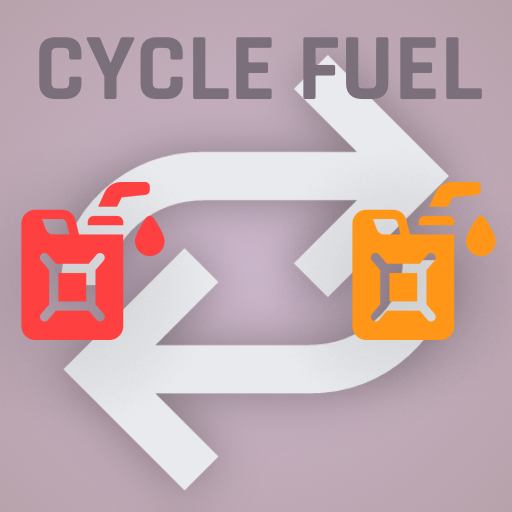

  

## Cycle Fuel

This mod allows you to quickly change the fuel type used by the equipment in your back with a simple key bind. Just press a key and switch fuels on the fly!

### Compatibility

The mod is designed to work seamlessly with **any back equipment**, so it should also be compatible with other mods, but please report any issues you encounter so we can address them.  
The mod is **purely client-based** and requires no special installation on the remote host. Its **multiplayer compatibility** has been tested on a dedicated server.

### Issues

If you encounter a problem with this mod, please report it on the [Issue Tracker](https://github.com/06-Games/CycleFuel/issues).

### License

The source code for this mod is distributed under the [GPL-3.0-or-later](LICENSE) license.
